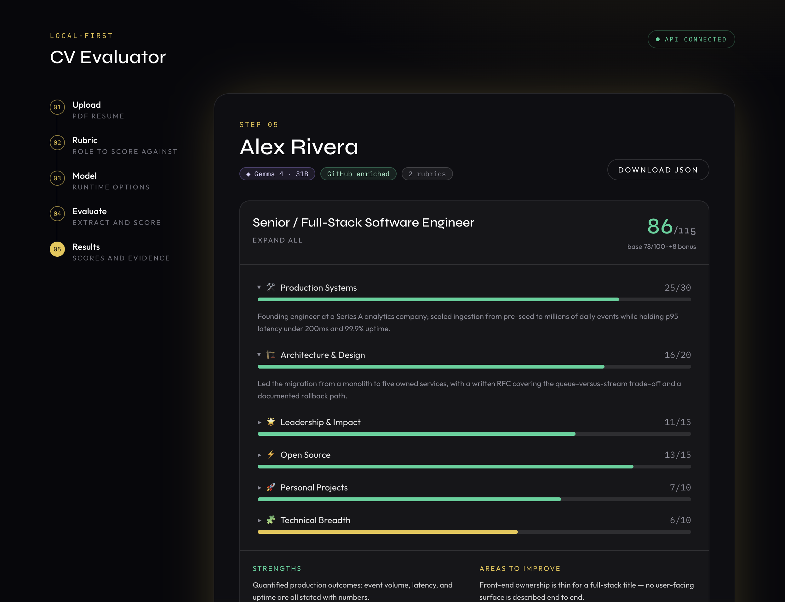
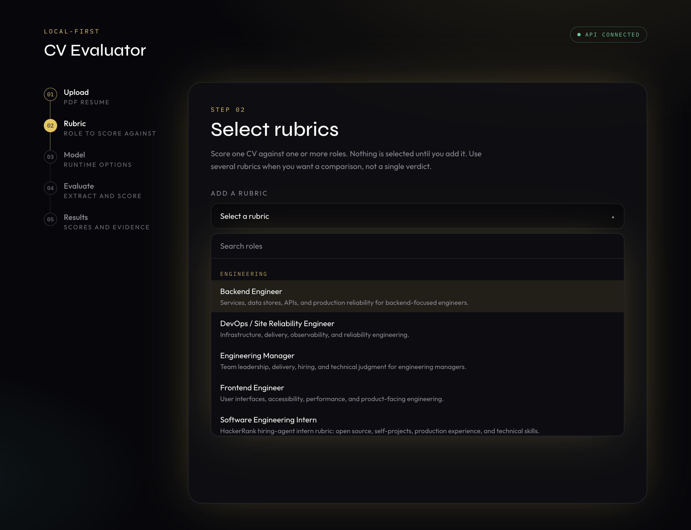
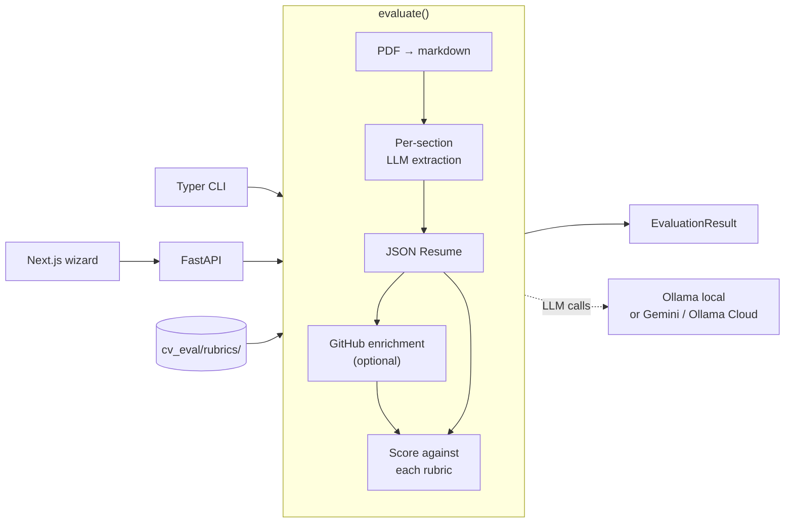

# CV Evaluator

Local-first CV scoring against **explainable hiring rubrics**. Upload a PDF, pick one or more roles, get a category-level score with evidence — on your machine.

Built around [interviewstreet/hiring-agent](https://github.com/interviewstreet/hiring-agent) (HackerRank, MIT): we vendor that resume-to-score pipeline and wrap it with multi-rubric scoring, a FastAPI service, a Next.js UI, and a CLI.

> Intended use: understand how a CV reads against a role, so you can improve it. This is not an ATS and not a hiring decision system.



<p align="center"><em>Every category score expands to the evidence that produced it. Data shown is fictional.</em></p>

## Why this exists

HackerRank's hiring-agent is a strong intern scoring pipeline. It is also a single hardcoded rubric, a CLI, and a model layer that assumes structured JSON. This project keeps that core and adds what you need to run it as a product:

- **Multi-rubric** — score one CV against several roles in one pass
- **A catalog you can extend** — drop a folder in `backend/cv_eval/rubrics/`
- **Local or BYOK cloud** — Ollama by default; Gemini 3.5 Flash or Ollama Cloud if you paste a key for that run
- **Two surfaces** — web wizard and `python -m cv_eval`

## Requirements

- **Python 3.11+**
- **Node.js 20+** (web UI only)
- An LLM: **[Ollama](https://ollama.com)** with a pulled model (`gemma4:latest` is the local default), **or** a Gemini / Ollama Cloud API key pasted on wizard step 03

## Quick start

Local Gemma 4 is the default path. No GPU? Skip the Ollama pull and paste a Gemini or Ollama Cloud key on step 03. The key is used for that evaluation only — never written to disk, `.env`, logs, or SSE.

Ollama (optional if you use a cloud key):

```bash
ollama serve
ollama pull gemma4:latest
```

### Anyone — one command

```bash
npx cv-evaluator
```

Provisions the API and the UI, then opens http://localhost:3000.

### From a clone

Same one-command path, using the tree in front of you:

```bash
npm run dev          # API + UI, reload on change → http://localhost:3000
```

Or the two processes separately (this is the usual contributor loop):

```bash
npm run api          # FastAPI  → http://localhost:8000
npm run web          # Next.js  → http://localhost:3000
```

`npm run api` creates `backend/.venv` and installs Python deps on first run. `npm run web` runs `npm install` in `frontend/` on first run.

Raw commands, if you prefer not to use the launcher:

```bash
# terminal 1 — API
cd backend
python3 -m venv .venv && source .venv/bin/activate
pip install -r requirements.txt
uvicorn cv_eval.api:app --reload --port 8000

# terminal 2 — UI
cd frontend
cp .env.example .env.local
npm install
npm run dev
```

CLI only (no browser):

```bash
cd backend
python3 -m venv .venv && source .venv/bin/activate
pip install -r requirements.txt
python -m cv_eval evaluate cv.pdf --role backend_engineer
```

### On packaging

The pipeline is Python. The npm package [`cv-evaluator`](https://www.npmjs.com/package/cv-evaluator) is a **launcher only** — it has zero dependencies and never reimplements pipeline logic, it just provisions and supervises the two services. Shipping the evaluation logic itself as JavaScript would wrap a subprocess and lie about the runtime. A PyPI package (`cv-eval`) is a later step, not required to run the UI.

GitHub enrichment is **off** by default. Unauthenticated GitHub allows 60 requests/hour; set `GITHUB_TOKEN` in `backend/.env` if you turn it on.

## CLI

```bash
python -m cv_eval evaluate <cv.pdf> [options]
   -r, --role NAME      rubric to score (repeatable)
       --compare        score against every rubric
   -m, --model NAME     LLM model (default: local auto-detect)
       --runtime NAME   local | ollama_cloud | gemini (default: local)
       --api-key KEY    per-run cloud key (prefer GEMINI_API_KEY / OLLAMA_API_KEY)
       --no-github      skip GitHub enrichment
       --html-out PATH  write an HTML report
       --json-out PATH  write the raw JSON result

python -m cv_eval roles
python -m cv_eval models
```

## API

| Method | Path               | Returns                          |
| ------ | ------------------ | -------------------------------- |
| GET    | `/health`          | status, default model, role names |
| GET    | `/models`          | local models plus `runtimes` catalogs |
| GET    | `/roles`           | rubric summaries (incl. department) |
| POST   | `/evaluate`        | JSON result                       |
| POST   | `/evaluate/stream` | SSE: `plan`, `stage`, `partial`, `complete`, `error` |
| POST   | `/evaluate/html`   | HTML report                       |

`POST` bodies are multipart: `file` (PDF), `roles` (comma-separated names or `all`), `enrich` (`true`/`false`), `model` (optional), `runtime` (`local` | `ollama_cloud` | `gemini`), `api_key` (cloud only, this request). Cloud keys are not stored, not copied to env, not logged, and not included in SSE events.

## Rubrics

Each rubric is `backend/cv_eval/rubrics/<name>/` with `role.json`, `criteria.jinja`, and `system_message.jinja`. The intern rubric is HackerRank's. The rest are community rubrics in the same format: four explicit point bands per category, fairness guardrails, an evidence standard that scores unsupported claims at zero, and `{{ text_content }}` so the model actually sees the CV.

Point `CV_EVAL_ROLES_DIR` at your own directory to use a private rubric set without forking.



| Department   | Role                         | Directory                       | Source     |
| ------------ | ---------------------------- | ------------------------------- | ---------- |
| Engineering  | Software Engineering Intern  | `software_engineering_intern`   | HackerRank |
| Engineering  | Senior / Full-Stack Engineer | `senior_full_stack_engineer`    | Community  |
| Engineering  | Backend Engineer             | `backend_engineer`              | Community  |
| Engineering  | Frontend Engineer            | `frontend_engineer`             | Community  |
| Engineering  | DevOps / SRE                 | `devops_sre`                    | Community  |
| Engineering  | Engineering Manager          | `engineering_manager`           | Community  |
| Data & ML    | Machine Learning Engineer    | `machine_learning_engineer`     | Community  |
| Data & ML    | Data Analyst                 | `data_analyst`                  | Community  |
| Product      | Product Manager              | `product_manager`               | Community  |
| Design       | Product Designer             | `product_designer`              | Community  |
| General      | General professional         | `general_professional`          | Community  |

Authoring: [`docs/authoring-a-rubric.md`](docs/authoring-a-rubric.md). Architecture: [`docs/architecture.md`](docs/architecture.md).

## How it works



Extraction is one LLM call per resume section; scoring is one call per selected rubric. Local models frequently ignore JSON-schema mode, so the provider retries without it and the parser recovers JSON from free-text-wrapped replies — a model that cannot honour the schema still yields a parseable evaluation.

LLM scores vary by model and temperature. Treat them as a structured critique, not a grade.

## Sample output

`POST /evaluate` returns `{ candidate_name, model, runtime, github_enriched, resume, github, evaluations[] }`. One entry from `evaluations[]`, produced by `gemma4:31b-mlx` against the `backend_engineer` rubric:

```json
{
  "role": "backend_engineer",
  "position_title": "Backend Engineer",
  "categories": [
    {
      "key": "systems_apis",
      "label": "Systems & APIs",
      "icon": "🔌",
      "score": 30.0,
      "max": 30,
      "evidence": "Owned shipment-tracking API (4.2k req/s peak, 38 consumers) with measured p99 latency reduction from 840ms to 145ms; built idempotent billing ledger handling $40M/yr."
    },
    {
      "key": "reliability",
      "label": "Reliability & Operations",
      "icon": "🛡",
      "score": 20.0,
      "max": 20,
      "evidence": "On-call lead who defined SLOs (99.95% availability) and drove MTTR reduction from 47min to 12min over four quarters."
    }
  ],
  "total_score": 100.0,
  "total_max": 100.0,
  "bonus_points": 12.0,
  "bonus_breakdown": "+5 for exceptional scale (4.2k req/s, 90M events/day, 4.1TB DB), +4 for maintaining pgqueue (2.1k stars), +3 for end-to-end ownership from RFC to SLOs.",
  "deductions": 5.0,
  "deduction_reasons": "-5 for named technologies (Go, Python, Kubernetes, Terraform, OpenTelemetry) appearing in skills list without described usage in experience bullets.",
  "key_strengths": [
    "Proven ability to optimize high-throughput APIs with quantified latency improvements",
    "Expertise in large-scale database migrations and data consistency patterns"
  ],
  "areas_for_improvement": [
    "Infrastructure tools (Kubernetes, Terraform) are listed but their specific application in the candidate's architecture is not described"
  ],
  "overall": 107.0,
  "max_final_score": 115
}
```

Categories are abridged here; the real response returns all five. Every score carries the evidence that produced it, which is the point — a number you cannot audit is not useful feedback.

## Layout

```
cv-evaluator/
├── backend/
│   ├── cv_eval/          # package: pipeline, API, CLI
│   │   ├── core/         # vendored hiring-agent (NOTICE.md)
│   │   └── rubrics/      # rubric definitions, shipped with the package
│   └── tests/
├── frontend/             # Next.js wizard
├── packages/launcher/    # npx cv-evaluator
└── docs/
```

## Development

```bash
# backend
cd backend && source .venv/bin/activate
python -m unittest tests.test_smoke tests.test_runtimes -v

# frontend
cd frontend
npm run typecheck
npm run lint
npm run build
```

## Status

v0.1. Local-first by default. Cloud models are opt-in per run via a pasted key that is never stored. The API binds to localhost and is not safe to expose to the internet as-is.

## Contributing

See [CONTRIBUTING.md](CONTRIBUTING.md). By participating you agree to the [Code of Conduct](CODE_OF_CONDUCT.md).

## Security

See [SECURITY.md](SECURITY.md). Do not file public issues for vulnerabilities.

## License

[MIT](LICENSE). Vendors parts of `interviewstreet/hiring-agent` (MIT) — see [`backend/cv_eval/core/NOTICE.md`](backend/cv_eval/core/NOTICE.md).
